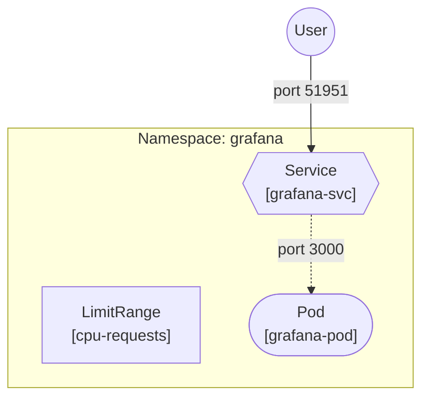

# GCP Cluster

## Structure

One direcory = One namespce.

Switch namespace (do not hardcode namespace):
```sh
kubectl config set-context --current --namespace=grafana
```

## Cluster Architecture

Notion → https://app.notion.com/p/marcodifrancesco/Kubernetes-Cluster-3845197aa18e80b0876afdc6cb41ee4b



## Next up

- Give pod persistent memory, separating the:
    - Static files → ConfigMaps
    - Dynamic settings → DB
