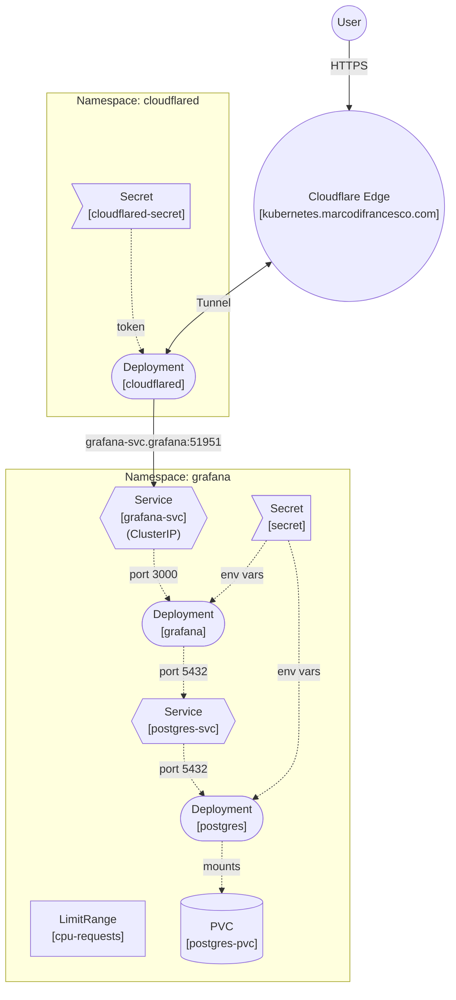

# ☸️ Kubernetes GCP

Infrastructure configuration for a personal Kubernetes cluster hosted on Google Cloud Platform (GCP). This repository contains the manifests to deploy and manage core services (currently Grafana + PostgreSQL).

This environment originated as a practical sandbox for the **Certified Kubernetes Application Developer (CKAD)** exam and now serves as a testing ground for Kubernetes primitives, stateful workloads, and ingress patterns.

## 🏗️ Architecture

The cluster runs a Grafana instance connected to a PostgreSQL database. Ingress is handled via a **Cloudflare Tunnel** (`cloudflared`), removing the need for a cloud-provisioned LoadBalancer and directly routing edge traffic to internal `ClusterIP` services.

> 📓 [Architecture & CKAD Reference Notes](https://app.notion.com/p/marcodifrancesco/Kubernetes-Cluster-3845197aa18e80b0876afdc6cb41ee4b)

## 🗺️ Implementation Backlog

The following tasks are formatted using CKAD-style specifications to simulate exam constraints during implementation.

### 0. State Separation
Decouple the application state from the pod lifecycle to ensure data persistence across restarts.
- **Static Configuration:** Store in `ConfigMap` resources.
- **Dynamic Data:** Migrate to a PostgreSQL database.

  **✅ DONE**

### 1. Database Credentials
Create a resource to securely store credentials. Name it `secret` with:
- `POSTGRES_DB`: `grafana`
- `POSTGRES_USER`: `grafana`
- `POSTGRES_PASSWORD`: `supersecret`

  **✅ DONE**

### 2. Database Storage
Create a PersistentVolumeClaim named `postgres-pvc` requesting:
- **Storage:** `1Gi`
- **Access Modes:** `ReadWriteOnce`

  **✅ DONE**

### 3. Database Workload & Networking
Create a Deployment named `postgres` and a Service named `postgres-svc`:
- **Image:** `postgres:15-alpine`
- **Container Port:** `5432`
- **Service Port:** `5432`
- **Volume Mount:** Mount your PVC to `/var/lib/postgresql/data`
- **Environment:** Inject all variables from `secret` into the container.

  **✅ DONE**

### 4. Grafana Reconfiguration
Update your existing Grafana Deployment. Add the following environment variables to the Grafana container to override its default SQLite behavior:
- `GF_DATABASE_TYPE`: `postgres`
- `GF_DATABASE_HOST`: `postgres-svc:5432`
- `GF_DATABASE_NAME`: reference the secret
- `GF_DATABASE_USER`: reference the secret
- `GF_DATABASE_PASSWORD`: reference the secret

  **✅ DONE**

### 5. Ingress & Exposing Services (Cloudflare Tunnel)
Create a new namespace and configure a Cloudflare tunnel to expose Grafana to the outside world, removing the need for a LoadBalancer.
- **Namespace:** `cloudflared`
- **Secret:** Create a secret named `cloudflared-secret` containing the `TUNNEL_TOKEN`.
- **Deployment:** Deploy `cloudflare/cloudflared:latest` passing the args `tunnel --no-autoupdate run` and injecting the token.
- **Domain Mapping:** Connect `kubernetes.marcodifrancesco.com` to `http://grafana-svc.grafana.svc.cluster.local:51951` in the Cloudflare Dashboard.

  **✅ DONE**

### 6. Stateful Workloads (PostgreSQL)
Replace your existing PostgreSQL `Deployment` with a `StatefulSet` to correctly manage its stateful nature.
- **Name:** `postgres-sts`
- **Image:** `postgres:15-alpine`
- **Replicas:** 1
- **Storage:** Use a `volumeClaimTemplates` named `postgres-data` requesting `1Gi` with `ReadWriteOnce` access mode.
- **Mount Path:** `/var/lib/postgresql/data`
- **Environment:** Inject all credentials using `envFrom` pointing to your secret.

  **🔲 TODO**

*(Hint: After deploying this, delete the old `postgres` Deployment and the standalone `postgres-pvc` you created in Step 2, as the StatefulSet will provision its own!)*

### 7. Resource Management
Add resource boundaries to your `grafana` Deployment to ensure cluster stability. Add the following to the `grafana` container:
- **Requests:** CPU `100m`, Memory `256Mi`
- **Limits:** CPU `200m`, Memory `512Mi`

  **🔲 TODO**

### 8. Health Checks
Add probes to the `grafana` container so Kubernetes knows when the application is actually healthy and ready to serve traffic.
- **Liveness Probe:** HTTP GET request to `/api/health` on port `3000`. Initial delay `15` seconds.
- **Readiness Probe:** HTTP GET request to `/api/health` on port `3000`. Initial delay `5` seconds.

  **🔲 TODO**

### 9. Secret Management Refactor
Refactor the `grafana` Deployment to bulk-inject secrets instead of mapping them individually.
- **Update the Deployment:** remove the individual `valueFrom.secretKeyRef` entries for the DB credentials and admin credentials.
- **Inject them dynamically:** using `envFrom` targeting your existing `secret` (which already contains the matching `GF_...` keys).

  **🔲 TODO**

### 10. High Availability (Scaling)
Production setups require redundancy. Update the `grafana` Deployment to ensure high availability.
- **Replicas:** `2`
- *Why:* If a Kubernetes worker node crashes, having at least two replicas ensures the Grafana UI remains accessible. For PostgreSQL, we leave it at `replicas: 1` in this basic setup because raw Postgres requires complex third-party tools (like Patroni) to safely manage multi-node replication (Leader/Follower).

  **🔲 TODO**
